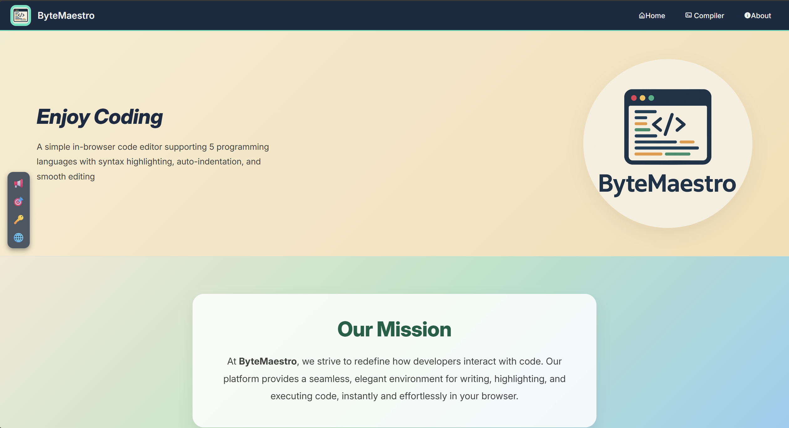
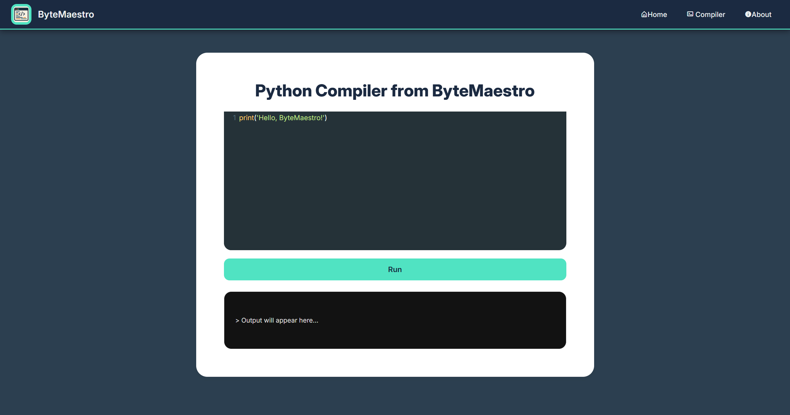
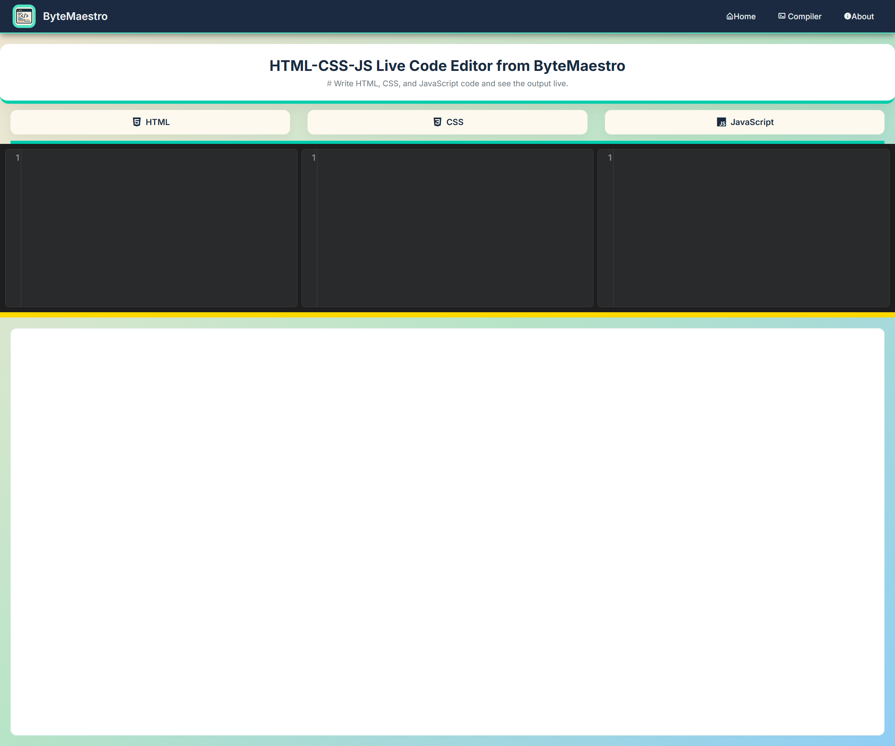

#   ByteMaestro 

**ByteMaestro** is a lightweight, in-browser code editor that supports live HTML-CSS-JS previews and code execution for various programming languages via a simplified interface. Built entirely with vanilla HTML, CSS, and JavaScript, it aims to provide an intuitive space for students, beginners, and tinkerers to write, run, and preview their code without setup hassle.

---

## 🌟 Why It Exists

Learning to code should be fast, visual, and frictionless. ByteMaestro was created to offer:
- 🔄 Instant feedback with live preview for web (HTML/CSS/JS)
- 🎯 A focused, minimalist interface to reduce distractions
- 🧪 Compiler support for selected languages with syntax highlighting
- 🧠 A tool to help beginners experiment and learn directly in the browser

Whether you're practicing Python, testing JS snippets, or building front-end layouts, ByteMaestro brings code to life.

---

## ✨ Features

- 🌐 **Multi-language support**: Write and run code in Python, JavaScript, C, C++, and Java
- 🧾 **HTML/CSS/JS Live Editor**: Auto-refresh preview, tabbed editor layout
- 🎨 **Syntax highlighting** via [CodeMirror](https://codemirror.net/)
- 📱 **Responsive design** for mobile and desktop

---

## 🖼 UI Preview





---

## 🚀 Getting Started

1. **Clone this repo**
   ```bash
   git clone https://github.com/ThangHoang54/ByteMaestro.git
   ```
2. **Open index.html in your browser**
3. **Start coding instantly!**

## Tech Tools

<p align="center">
   <a href="https://skillicons.dev">
        
   </a>
</p>

---

## 🙌 Acknowledgements
- CodeMirror – Code editor magic ✨
- Boxicons – Beautiful icon set
- Inspiration from open-source editors like JSFiddle, CodePen, and Replit
- Gratitude to all contributors and users who help improve the system through feedback and suggestions.


